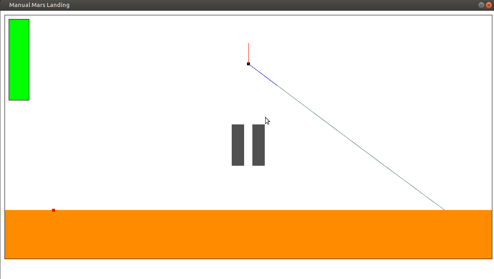
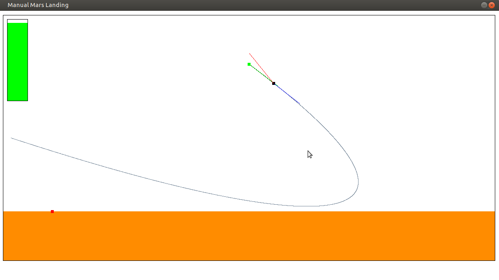

# Mars Landing Game

Play a powered-descent mars landing worst-case scenario. Control the lander with a direction and magnitude separate controls. The difficulty resides in the minimum thrust constraint, ie the thrusters cannot be shut down.  Fuel is also limited.

## Pre-requisite

- SDL2
- Joystick / Gamepad

## Installation

### In-place build

```
git clone https://github.com/florian-die/mars-landing-sdl.git
cd mars-landing-sdl
mkdir build
cd build
cmake ..
make
./marslanding
```

### Out of source build

Use `cmake-gui` to configure and generate in a separate build folder, then `make` and `./marslanding`

### Windows

Follow https://trenki2.github.io/blog/2017/06/02/using-sdl2-with-cmake/ to link SDL2 using CMake.

Build using your favorite IDE. Copy the SDL2.dll file alongside the executable.

## Gamepad configuration 

### Xbox one gamepad configuration

- `xow` at https://github.com/medusalix/xow 
- `xpadneo` at https://github.com/atar-axis/xpadneo.git

Works for a wireless xbox one elite gamepad (also works in VirtualBox)

### Others

Check SDL2 doc


## Features
- control magnitude and direction separatly
- display thrust and velocity vector
- display fuel gauge
- trajectory prediction with current thrust 
- gravity compensating when idle joystick
- outputs lander state in console
- start / pause / reset


## Controls

```
====================================
=========== MARS LANDING ===========
====================================
=            __________            =
=           |          |           =
=           |          |           =
=           |__________|           =
=          /|          |\          =
=         /_|          |_\         =
=          U            U          =
=          U            U          =
=                                  =
====================================
====================================
============= Controls =============
====================================
= Start / Pause    : Start Button  =
= Reset            : Back Button   =
= Thrust Direction : Left Stick    =
= Thrust Magnitude : Right Trigger =
= Show Prediction  : Y Button      =
====================================
============ TANGO DELTA ===========
====================================

```

## Screenshots





```
Current state (t=21.95s) 
{
  X = 3824.80 m
  Z = -0.28 m
  VX = 81.27 m/s
  VZ = -67.67 m/s
  M = 1814.83 kg (DRY @ 1505.00)
  TX = 0.00 N
  TZ = 6736.19 N
  |T| = 6736.19 N (40%)
}
```

## References

ACIKMESE, Behcet et PLOEN, Scott R. Convex programming approach to powered descent guidance for mars landing. Journal of Guidance, Control, and Dynamics, 2007, vol. 30, no 5, p. 1353-1366.